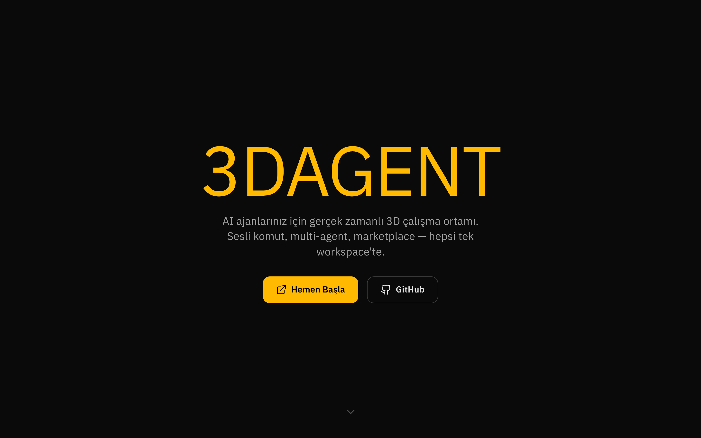

<p align="center">
  
</p>

# 3DAgent — 3D AI Agent Workspace

AI ajanlariniz icin gercek zamanli 3D calisma ortami.
Sesli komut, coklu ajan yonetimi, sirket kurma, kanban, marketplace ve PWA — hepsi tek workspace'te.

> Fork: [iamlukethedev/Claw3D](https://github.com/iamlukethedev/Claw3D) | Lisans: MIT

<p align="center">
  
</p>

---

## Ozellikler

### 3D Retro Ofis
- Ajanlarin masalarinda calistigi, hareket ettigi paylasimli 3D ortam
- Odalar, masalar, navigasyon, animasyonlar ve olay tabanli aktivite ipuclari
- Ofis duzeni builder'i (`/office/builder`) ile ozellestirme
- Isi haritasi ve iz takibi
- Ataturk portresi (altin cerceveli, spot isikli)
- Turk bayragi direği

### Turk Mitolojisi Temali AI Ekibi
6 hazir ajan, Turk mitolojisinden ilham alan isim ve kisiliklerle:

| Ajan | Rol | Vibe |
|------|-----|------|
| Asena | Bas Gelistirici | Kod yazan disi kurt |
| Umay | UX/Tasarim | Kullaniciyi koruyan ana tanrica |
| Kayra | DevOps & Altyapi | Dunyayi duzenleyen yaratici tanri |
| Erlik | QA & Guvenlik | Yeraltinin bekci tanrisi |
| Tulpar | Pazarlama & Icerik | Kanatlari ruzgar olan savas ati |
| Tengri | Proje Yonetimi | Gokyuzu tanrisi, buyuk resmi goren |

Her ajanin kendi tanitim ekrani, uzmanlik alanlari, kisilik dosyalari (SOUL.md, IDENTITY.md, AGENTS.md) ve 3D avatari vardir.

### Sirket Kurma (Company Builder)
- Tek bir istemden AI tabanli sirket olusturma
- Turkce isim, rol, sorumluluk ve kisilik otomatik uretimi
- Organizasyon semasi onizleme
- Rol ekleme/cikarma/duzenleme
- Mevcut ajanlari otomatik degistirme

### Ajan Yonetimi
- Filo kenar cubugundan ajan olusturma, yapilandirma ve izleme
- Gercek zamanli sohbet + komut onaylama
- Ajan tanitim ekrani: rol, uzmanlik alanlari, kisilik ozeti
- Avatar ozellestirme ve beyin dosyalari duzenleme
- Ajan yetenekleri (skills) yonetimi

### Gateway Mimarisi
- **OpenClaw** — Resmi gateway protokolu
- **Hermes** — WebSocket adaptoru ile alternatif runtime
- **Demo** — Gercek backend olmadan ofisi kesfetmek icin mock gateway
- **Custom** — Kendi orchestrator/runtime'inizi baglayin
- Same-origin WebSocket proxy (tarayici → Studio → Gateway)

### Imersif Ekranlar

<p align="center">
  
</p>

| Ekran | Aciklama |
|-------|----------|
| GitHub Kod Inceleme Odasi | PR inceleme, diff, satirici yorum |
| Kanban Panosu | Surukle-birak gorev yonetimi, ajan atama |
| ATM / Hazine | Token kullanim defteri, butce uyarilari |
| Telefon Kabini | Sesli/yazili ajan iletisimi |
| Mesajlasma Kabini | SMS tarzi mesajlasma |
| Kahvehane | Test ve sohbet kosesi |
| Kapalicarsi | Beceri pazari (marketplace) |

### HQ Karargah Panelleri

<p align="center">
  
</p>

- **Gelen Kutusu** — Bildirimler ve onay istekleri
- **Gecmis** — Oturum gecmisi ve denetim gunlugu
- **Kanban** — Gorev yonetimi panosu
- **Playbook'lar** — Otomatik is akislari ve zamanlanmis gorevler
- **Gorev Kuyrugu** — Ajanlar arasi gorev atama ve takibi
- **Hafiza Duvari** — Ajanlar arasi paylasimli not sistemi
- **Analitik** — Kullanim, harcama ve performans metrikleri

### Hafiza Duvari (Memory Wall)

<p align="center">
  
</p>

- Ajanlar arasi paylasimli post-it not sistemi
- 5 renk secenegi ile gorsel kategorizasyon
- Yazar ismi ve zaman damgasi
- localStorage ile kalici depolama

### Gorev Kuyrugu (Task Queue)

<p align="center">
  
</p>

- Ajanlar arasi gorev atama sistemi
- 4 oncelik seviyesi (dusuk, normal, yuksek, acil)
- 3 durum takibi (beklemede, devam ediyor, tamamlandi)
- 6 preset ajan arasinda gorev yonlendirme
- Filtreleme ve localStorage kaliciligi

### Guvenlik (SafeSkillScanner)
- Ajan komutlarini regex tabanli guvenlik taramasi
- 20 kural: dosya sistemi, ag, kimlik bilgileri, yetki yukseltme
- Tehlikeli komutlar engellenir, uyarilar bildirilir
- `rm -rf /`, fork bomb, `curl | bash` gibi pattern'ler yakalanir

### Ses Destegi
- **Groq Whisper** ile sesli mesaj transkripsiyon
- **ElevenLabs TTS** ile sesli ajan yanitlari
- Ses secimi ve hiz ayari
- Turkce hata mesajlari

### PWA & Cevrimdisi Destek
- Service worker (Serwist) ile cevrimdisi calisma
- Guncelleme bildirimi banner'i
- Uygulamayi ana ekrana ekleme (standalone)
- Otomatik ikon uretimi (192x192, 512x512)

### Turkce Lokalizasyon
- 1300+ ceviri anahtari
- Tum UI bilesenleri, onboarding, ayarlar, paneller Turkce
- Sirket kurma, ajan kisilikleri, hata mesajlari Turkce
- AI prompt'lari Turkce icerik uretir

### Coklu Ofis Destegi
- Uzak ofis baglantisi (presence endpoint veya OpenClaw gateway)
- Salt okunur uzak ajan goruntuleme
- Etiket ve kaynak turu yapilandirmasi

### Spotify Jukebox (SOUNDCLAW)
- Ofiste muzik calma
- OAuth entegrasyonu

---

## Hizli Baslangic

### 1. Kaynak Koddan

```bash
git clone https://github.com/cemal-demirci/3dagent.git
cd 3dagent
npm install
npm run setup        # Interaktif kurulum wizard'i
npm run dev          # http://localhost:3000
```

`npm run setup` sunlari otomatik halleder:
- Node.js ve npm surum kontrolu
- Claude CLI kurulum + OAuth giris
- Gemini CLI kontrolu + auth
- `.env` dosyasi olusturma
- API key girisi (opsiyonel)
- Demo gateway baglanti testi

### 2. Docker ile

```bash
docker compose up -d
# http://localhost:3000
```

### 3. Demo Modu (Backend Gerekmez)

```bash
npm run dev
# Demo backend otomatik baslar (port 18789)
# Baglanti ekraninda "Demo ile Basla" butonuna tiklayin
```

---

## Teknik Altyapi

| Katman | Teknoloji |
|--------|-----------|
| Frontend | Next.js 16, React 19, TypeScript 5 |
| 3D Grafik | Three.js, React Three Fiber, Drei |
| Oyun Motoru | Phaser (builder ve interaktif yuzeyler) |
| Stil | Tailwind CSS 4 |
| AI SDK'lar | Claude Agent SDK, Google Gemini, OpenAI |
| Gercek Zamanli | WebSocket (ws) |
| Ses | Groq Whisper (STT), ElevenLabs (TTS) |
| PWA | Serwist (service worker) |
| Test | Vitest (unit), Playwright (e2e) |
| Sunucu | Node.js custom server (HTTP/HTTPS + WS proxy) |
| CI/CD | GitHub Actions (lint → typecheck → test → build) |

---

## Proje Yapisi

```
3dagent/
├── server/                    # Node.js backend
│   ├── index.js               # Ana sunucu (HTTP/HTTPS + Next.js)
│   ├── access-gate.js         # Token kimlik dogrulama
│   ├── gateway-proxy.js       # WebSocket proxy
│   ├── rate-limiter.js        # IP bazli hiz sinirlandirici
│   ├── security-headers.js    # Guvenlik basliklari
│   ├── logger.js              # JSON logger
│   ├── demo-gateway-adapter.js # Demo gateway (mock AI)
│   └── hermes-gateway-adapter.js # Hermes adaptoru
│
├── scripts/
│   ├── setup.js               # Otomatik kurulum wizard'i
│   ├── generate-pwa-icons.mjs # PWA ikon uretici
│   └── take-screenshots.mjs   # README ekran goruntusu uretici
│
├── src/
│   ├── app/                   # Next.js App Router
│   │   ├── layout.tsx         # Root layout + metadata + PWA
│   │   ├── page.tsx           # Landing sayfasi
│   │   ├── office/            # Ana ofis arayuzu
│   │   ├── offline/           # Cevrimdisi fallback
│   │   ├── sw.ts              # Service worker kaynagi
│   │   └── api/               # API route'lari
│   │
│   ├── features/
│   │   ├── agents/            # Ajan bilesenleri, state, islemler
│   │   ├── office/            # Ofis UI, paneller, imersif ekranlar
│   │   │   └── components/panels/  # HQ panelleri
│   │   │       ├── MemoryWallPanel.tsx  # Hafiza Duvari
│   │   │       └── TaskQueuePanel.tsx   # Gorev Kuyrugu
│   │   ├── retro-office/      # 3D retro ofis motoru
│   │   ├── company-builder/   # Sirket olusturucu
│   │   ├── onboarding/        # Baslangic wizard'i
│   │   ├── pwa/               # PWA guncelleme banner'i
│   │   └── spotify-jukebox/   # Muzik calar
│   │
│   └── lib/
│       ├── i18n/              # Turkce ceviriler (1300+ key)
│       ├── gateway/           # Gateway iletisimi
│       ├── agents/            # Preset ajanlar, kisilik dosyalari
│       ├── security/          # SafeSkillScanner guvenlik modulu
│       ├── studio/            # Studio ayarlari
│       ├── voiceReply/        # ElevenLabs TTS
│       ├── openclaw/          # Ses transkripsiyon (Groq Whisper)
│       └── notifications.ts   # Masaustu bildirimleri
│
├── tests/                     # Unit + E2E testler
├── docs/                      # Mimari, API, rehber dokumanlari
├── public/                    # Statik dosyalar, PWA manifest, ikonlar
├── .github/workflows/         # CI/CD pipeline
├── Dockerfile                 # Multi-stage Docker build
├── docker-compose.yml         # Docker Compose
└── package.json               # v0.1.4
```

---

## Ortam Degiskenleri

| Degisken | Aciklama | Varsayilan |
|----------|----------|------------|
| `PORT` | Sunucu portu | 3000 |
| `HOST` | Sunucu adresi | 0.0.0.0 |
| `DEBUG` | OpenClaw konsol | true |
| `STUDIO_ACCESS_TOKEN` | Uzak erisim tokeni | — |
| `DEMO_ADAPTER_PORT` | Demo gateway portu | 18789 |
| `ANTHROPIC_API_KEY` | Claude API | — |
| `GEMINI_API_KEY` | Gemini API | — |
| `OPENAI_API_KEY` | OpenAI API | — |
| `GROQ_API_KEY` | Groq Whisper + LLM | — |
| `ELEVENLABS_API_KEY` | ElevenLabs TTS | — |
| `ELEVENLABS_VOICE_ID` | Ses secimi | — |
| `RATE_LIMIT_MAX` | Pencere basina max istek | 120 |
| `RATE_LIMIT_WINDOW_MS` | Pencere suresi (ms) | 60000 |
| `LOG_LEVEL` | Log seviyesi | info |
| `CORS_ORIGIN` | CORS izni | — |

Tum degiskenler: [`.env.example`](.env.example)

---

## Komutlar

| Komut | Aciklama |
|-------|----------|
| `npm run setup` | Interaktif kurulum wizard'i |
| `npm run dev` | Gelistirme sunucusu (demo gateway dahil) |
| `npm run build` | Production build |
| `npm run start` | Production sunucu |
| `npm run demo-gateway` | Bagimsiz demo gateway |
| `npm run hermes-adapter` | Hermes adaptorunu baslat |
| `npm run generate:pwa-icons` | PWA ikonlarini uret |
| `npm run lint` | ESLint |
| `npm run typecheck` | TypeScript kontrol |
| `npm run test` | Unit testler (Vitest) |
| `npm run e2e` | E2E testler (Playwright) |
| `docker compose up -d` | Docker ile calistir |

---

## Baglanti Senaryolari

### Yerel Gateway + Yerel Studio
```bash
npm run dev
# http://localhost:3000 → ws://localhost:18789
```

### Uzak Gateway (Tailscale)
```bash
# Gateway host'ta:
tailscale serve --yes --bg --https 443 http://127.0.0.1:18789
# Studio'da URL: wss://<gateway-host>.ts.net
```

### Uzak Gateway (SSH Tunel)
```bash
ssh -L 18789:127.0.0.1:18789 user@<gateway-host>
# Studio'da URL: ws://localhost:18789
```

### Demo Modu
```bash
npm run dev
# Demo backend otomatik baslar, "Demo ile Basla" tiklayin
```

---

## Guvenlik

- Guvenlik basliklari (X-Content-Type-Options, X-Frame-Options, HSTS, vb.)
- IP bazli rate limiting
- Yapilandirilabilir CORS
- Token tabanli erisim kapisi
- Non-root Docker kullanici
- Gateway tokenlari sunucu tarafinda — tarayicida saklanmaz
- SafeSkillScanner ile tehlikeli komut tespiti (20 regex kurali)

---

## Sorun Giderme

| Sorun | Cozum |
|-------|-------|
| Baglanti basarisiz | Gateway URL ve token'i kontrol edin |
| `EPROTO` hatasi | `wss://` yerine `ws://` deneyin |
| `INVALID_REQUEST` | Gateway eski — guncelleyin veya demo kullanin |
| `401 Studio access token` | `STUDIO_ACCESS_TOKEN` ayarli, cookie eksik |
| CLI bulunamadi | `npm run setup` calistirin |
| GROQ API key hatasi | Ayarlar → AI Anahtarlari'ndan key ekleyin |
| Kanban acilmiyor | Demo gateway baglantisinizi kontrol edin |

---

## Ekran Goruntuleri

| Ekran | Goruntu |
|-------|---------|
| Landing Sayfasi | [landing-page.png](docs/images/landing-page.png) |
| 3D Ofis | [office-main.png](docs/images/office-main.png) |
| Kanban Panosu | [kanban-board.png](docs/images/kanban-board.png) |
| HQ Karargah | [settings-panel.png](docs/images/settings-panel.png) |
| Hafiza Duvari | [memory-wall.png](docs/images/memory-wall.png) |
| Gorev Kuyrugu | [task-queue.png](docs/images/task-queue.png) |
| Ofis Builder | [office-builder.png](docs/images/office-builder.png) |

---

## Dokumantasyon

| Dosya | Icerik |
|-------|--------|
| [ARCHITECTURE.md](ARCHITECTURE.md) | Sistem mimarisi ve tasarim kararlari |
| [API.md](API.md) | API endpoint dokumantasyonu |
| [VISION.md](VISION.md) | Proje vizyonu ve hedefleri |
| [ROADMAP.md](ROADMAP.md) | Gelistirme yol haritasi |
| [CONTRIBUTING.md](CONTRIBUTING.md) | Katki rehberi |
| [CREATING_SKILLS.md](CREATING_SKILLS.md) | Yetenek olusturma rehberi |
| [SECURITY.md](SECURITY.md) | Guvenlik politikasi |
| [CODE_DOCUMENTATION.md](CODE_DOCUMENTATION.md) | Kod haritasi ve okuma sirasi |

---

## Lisans

MIT — Orijinal proje [iamlukethedev/Claw3D](https://github.com/iamlukethedev/Claw3D)'den fork edilmistir.

Gelistirici: [Cemal Demirci](https://cemal.cloud) | [GitHub](https://github.com/cemal-demirci)
